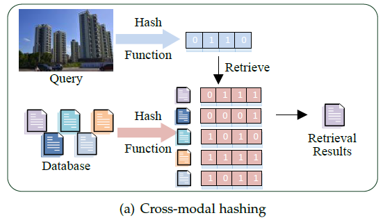
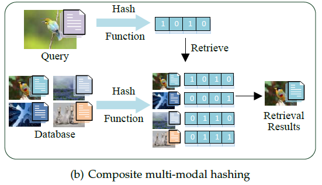

# Hashing Retrieval Library
- [Introduction](#introduction)
    - [Background](#background)
- [Supported Methods](#supported-methods)
    - [Cross-modal Hashing](#cross-modal-hashing) 
    - [Composite Multi-modal Hashing](#composite-multi-modal-hashing) 
- [Usage](#usage)
- [Contact](#contact)
- [Citation](#citation)
- [Acknowledgment](#acknowledgment)

## Introduction
This library is an open-source repository that contains most of SOTA cross-modal hashing methods and composite multi-modal hashing methods.

### Background
With the explosive growth of multi-modal contents, multi-modal retrieval is facing unprecedented challenges in both storage cost and retrieval speed. Hashing technique can project high-dimensional data into compact binary hash codes with faster computation and lower storage cost. In this library, we mainly focus on two hashing tasks:

- cross-modal hashing
- composite multi-modal hashing

The difference between them is shown as follows:

## Supported Methods
The currently supported algorithms include:

### Cross-modal Hashing

 #### 2022

- **HMAH: Efficient Hierarchical Message Aggregation Hashing for Cross-Modal Retrieval (TMM2022)**  [[PDF]](https://ieeexplore.ieee.org/document/9782694) [[Code]](https://github.com/FutureTwT/HMAH)

- **DOCH: Discrete Online Cross-Modal Hashing (PR2022)** [[PDF]](https://www.sciencedirect.com/science/article/pii/S0031320321004428) [[Code]](https://github.com/yw-zhan/DOCH)

- **DCHUC: Deep Cross-Modal Hashing with Hashing Functions and Unified Hash Codes Jointly Learning (KDE2022)** [[PDF]](https://ieeexplore.ieee.org/abstract/document/9069300) [[Code]](https://github.com/rongchengtu1/DCHUC)

#### 2021

- **DGCPN: Deep Graph-neighbor Coherence Preserving Network for Unsupervised Cross-modal Hashing (AAAI2021)**  [[PDF]](https://ojs.aaai.org/index.php/AAAI/article/view/16592) [[Code]](https://github.com/Atmegal/DGCPN)

- **BATCH: A Scalable Asymmetric Discrete Cross-Modal Hashing (TKDE2021)**  [[PDF]](https://ieeexplore.ieee.org/document/9001235) [[Code]](https://github.com/yxinwang/BATCH-TKDE2020)

- **MTFH: A Matrix Tri-Factorization Hashing Framework for Efficient Cross-Modal Retrieval (PAMI2021)** [[PDF]](https://ieeexplore.ieee.org/abstract/document/8827941) [[Code]](https://github.com/starxliu/MTFH)

- **ASCSH: Asymmetric Supervised Consistent and Specific Hashing for Cross-Modal Retrieval (TIP2021)** [[PDF]](https://ieeexplore.ieee.org/abstract/document/9269445) [[Code]](https://github.com/minmengzju/ASCSH)

#### 2020

- **UKD: Creating Something from Nothing Unsupervised Knowledge Distillation for Cross Modal Hashing (CVPR2020)**  [[PDF]](https://openaccess.thecvf.com/content_CVPR_2020/html/Hu_Creating_Something_From_Nothing_Unsupervised_Knowledge_Distillation_for_Cross-Modal_Hashing_CVPR_2020_paper.html) [[Code]](https://github.com/huhengtong/UKD_CVPR2020)

- **JDSH: Joint-modal Distribution-based Similarity Hashing for Large-scale Unsupervised Deep Cross-modal Retrieval (SIGIR2020)** [[PDF]](https://dl.acm.org/doi/abs/10.1145/3397271.3401086) [[Code]](https://github.com/KaiserLew/JDSH)

- **LEMON: Label Embedding Online Hashing for Cross-Modal Retrieval (MM2020)** [[PDF]](https://dl.acm.org/doi/abs/10.1145/3394171.3413971) [[Code]](https://github.com/yxinwang/LEMON-MM2020)

- **OCMFH: Online Collective Matrix Factorization Hashing for Large-Scale Cross-Media Retrieval (SIGIR2020)** [[PDF]](https://dl.acm.org/doi/abs/10.1145/3397271.3401132) [[Code]](https://github.com/Wangdi-Xidian/OCMFH)

#### Others

- **DJSRH: Deep Joint-Semantics Reconstructing Hashing for Large-Scale Unsupervised Cross-Modal Retrieval (ICCV2019)** [[PDF]](https://openaccess.thecvf.com/content_ICCV_2019/html/Su_Deep_Joint-Semantics_Reconstructing_Hashing_for_Large-Scale_Unsupervised_Cross-Modal_Retrieval_ICCV_2019_paper.html) [[Code]](https://github.com/zs-zhong/DJSRH)

- **DLFH: Discrete Latent Factor Model for Cross-Modal Hashing (TIP2019)** [[PDF]](https://ieeexplore.ieee.org/abstract/document/8636536) [[Code]](https://github.com/jiangqy/DLFH-TIP2019)

- **SCRATCH: A Scalable Discrete Matrix Factorization Hashing for Cross-Modal Retrieval (MM2018)** [[PDF]](https://dl.acm.org/doi/abs/10.1145/3240508.3240547) [[Code]]()

- **SSAH: Self-Supervised Adversarial Hashing Networks for Cross-Modal Retrieval (CVPR2018)** [[PDF]](https://openaccess.thecvf.com/content_cvpr_2018/html/Li_Self-Supervised_Adversarial_Hashing_CVPR_2018_paper.html) [[Code]](https://github.com/lelan-li/SSAH)

- **DCH: Learning Discriminative Binary Codes for Large-scale Cross-modal Retrieval (TIP2017)** [[PDF]](https://ieeexplore.ieee.org/abstract/document/7867785) [[Code]]()

- **DCMH: Deep Cross-Modal Hashing (CVPR2017)** [[PDF]](https://openaccess.thecvf.com/content_cvpr_2017/html/Jiang_Deep_Cross-Modal_Hashing_CVPR_2017_paper.html) [[Code]](https://github.com/jiangqy/DCMH-CVPR2017)

- **CCQ: Composite Correlation Quantization for Efficient Multimodal Retrieval (SIGIR2016)** [[PDF]](https://dl.acm.org/doi/abs/10.1145/2911451.2911493) [[Code]]()

- **SMFH: Supervised Matrix Factorization Hashing for Cross-Modal Retrieval (IJCAI2016)** [[PDF]](https://ieeexplore.ieee.org/abstract/document/7466099) [[Code]](https://github.com/LynnHongLiu/SMFH))

- **STMH: Semantic Topic Multimodal Hashing for Cross-Media Retrieval (AAAI2015)** [[PDF]](https://www.ijcai.org/Abstract/15/546) [[Code]](https://github.com/Wangdi-Xidian/STMH)

- **SePH: Semantics-preserving Hashing for Cross-view Retrieval (CVPR2015)** [[PDF]](https://openaccess.thecvf.com/content_cvpr_2015/html/Lin_Semantics-Preserving_Hashing_for_2015_CVPR_paper.html) [[Code]]()

- **CMFH: Collective Matrix Factorization Hashing for Multimodal Data (CVPR2014)**  [[PDF]](https://openaccess.thecvf.com/content_cvpr_2014/html/Ding_Collective_Matrix_Factorization_2014_CVPR_paper.html) [[Code]]()

- **LSSH: Latent Semantic Sparse Hashing for Cross-modal Similarity Search (SIGIR2014)** [[PDF]](https://dl.acm.org/doi/abs/10.1145/2600428.2609610) [[Code]]()

- **SCM: Large-Scale Supervised Multimodal Hashing with Semantic Correlation Maximization (AAAI2014)** [[PDF]](https://ojs.aaai.org/index.php/AAAI/article/view/8995) [[Code]]()

- **IMH: Inter-media Hashing for Large-scale Retrieval from Heterogeneous Data Sources (SIGMOD2013)** [[PDF]](https://dl.acm.org/doi/abs/10.1145/2463676.2465274) [[Code]]()

- **CVH: Learning Hash Functions for Cross-View Similarity Search (AAAI2011)** [[PDF]](https://www.aaai.org/ocs/index.php/IJCAI/IJCAI11/paper/view/3350/3446) [[Code]]()

### Composite Multi-modal Hashing

#### 2022

- **BSTH: Bit-aware Semantic Transformer Hashing for Multi-modal Retrieval (SIGIR2022)**  [[PDF]](https://dl.acm.org/doi/10.1145/3477495.3531947)[[Code]](https://github.com/FutureTwT/BSTH)

#### 2021

- **APMH(SAPMH/UAPMH): Adaptive Partial Multi-view Hashing for Efficient Social Image Retrieval (TMM2021)**  [[PDF]](https://ieeexplore.ieee.org/document/9257004) [[Code]](https://github.com/ChaoqunZheng/APMH)

#### 2020

- **DCMVH: Deep Collaborative Multi-View Hashing for Large-Scale Image Search (TIP2020)** [[PDF]](https://ieeexplore.ieee.org/abstract/document/9007019) [[Code]](https://github.com/lxuu306/DCMVH)

- **EPAMH: Efficient parameter-free adaptive multi-modal hashing (SPL2020)** [[PDF]](https://ieeexplore.ieee.org/abstract/document/9137647) [[Code]](https://github.com/ChaoqunZheng/EPAMH)

- **FDCMH: Fast Discrete Collaborative Multi-modal Hashing for Large-scale Multimedia Retrieval (TKDE2020)** [[PDF]](https://ieeexplore.ieee.org/abstract/document/8700276)

- **SDMH: Efficient Supervised Discrete Multi-view Hashing for Large-scale Multimedia Search (TMM2020)** [[PDF]](https://ieeexplore.ieee.org/abstract/document/8868211) [[Code]](https://github.com/lxuu306/SDMH)

#### Others

- **OMH-DQ: Online Multi-modal Hashing with Dynamic Query-adaption (SIGIR2019)** [[PDF]](https://dl.acm.org/doi/abs/10.1145/3331184.3331217) [[Code]](https://github.com/lxuu306/OMH-DQ_SIGIR2019)

- **FOMH: Flexible Online Multi-modal Hashing for Large-scale Multimedia Retrieval (MM2019)** [[PDF]](https://dl.acm.org/doi/abs/10.1145/3343031.3350999) [[Code]](https://github.com/lxuu306/FOMH)

- **DMVH: Discrete Multi-view Hashing for Effective Image Retrieval (ICMR2017)** [[PDF]](https://dl.acm.org/doi/abs/10.1145/3078971.3078981) 

- **MvDH: Multiview Discrete Hashing for Scalable Multimedia Search (TIST2018)** [[PDF]](https://dl.acm.org/doi/abs/10.1145/3178119)

- **MAH: Multiview alignment hashing for efficient image search (TIP2015)** [[PDF]](https://ieeexplore.ieee.org/abstract/document/7006770)

- **MVLH: Multi-view latent hashing for efficient multimedia search (MM2015)** [[PDF]](https://dl.acm.org/doi/abs/10.1145/2733373.2806342)

- **MFKH: Multiple feature kernel hashing for large-scale visual search (PR2014)** [[PDF]](https://www.sciencedirect.com/science/article/abs/pii/S0031320313003452)

- **MFH: Effective multiple feature hashing for large-scale near-duplicate video retrieval (TMM2013)** [[PDF]](https://ieeexplore.ieee.org/abstract/document/6553136)

## Usage

### Folder Struture

Each method folder contains 'code/', 'result/' and 'train.sh':

- **"code/"** Source codes folder.

- **"result/"** Result folder. Testing results will be recorded in file with the suffix of '.txt'.

- **"train.sh"** Training script. 'dataname' and 'hash bits' can be adjusted here.

### Datasets

**Cross-modal Hashing**

Dataset link:

    Baidu Yun Link: https://pan.baidu.com/s/1QnC4ZyvjKOakKtUR9Cqd4A
    Code: 6fb3

Pre-trained model link:

    Baidu Yun Link:https://pan.baidu.com/s/1fJm8t9-YoSJ-4wSRv7ugxA 
    Code: 6fb3 

**Composite mross-modal Hashing**

Dataset link:

    Baidu Yun Link: https://pan.baidu.com/s/1xw9YZKyX1dBggswVMUfqxQ 
    Code: 43gn

## Contact

If you have any questions or suggestions, feel free to contact
- Wentao Tan (tan.wt.lucky@gmail.com)
- Lei Zhu (leizhu0608@gmail.com) (Professor)

or raise an issue.

## Citation
To be determined.
